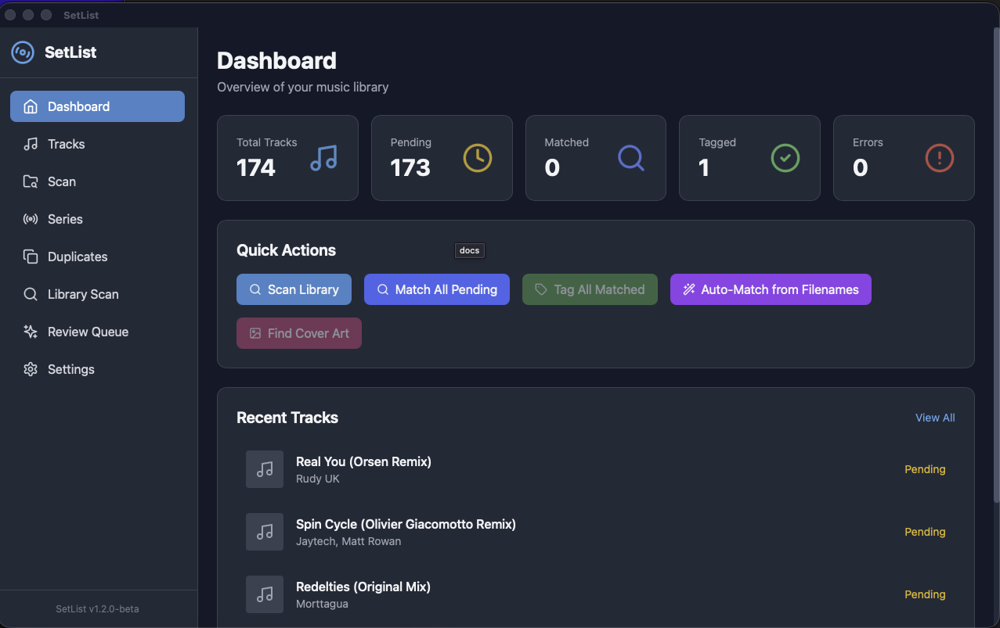
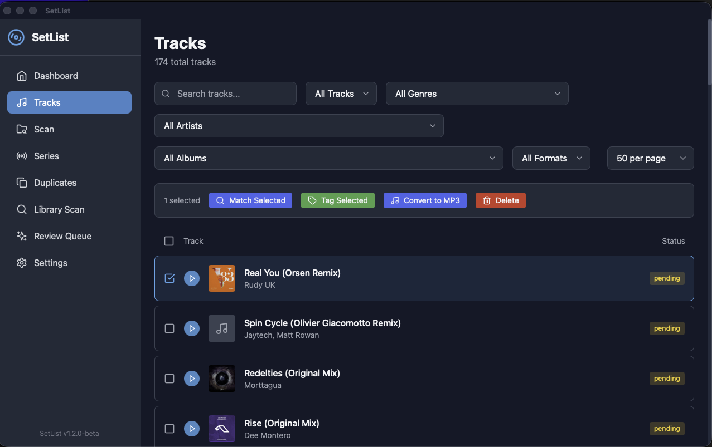
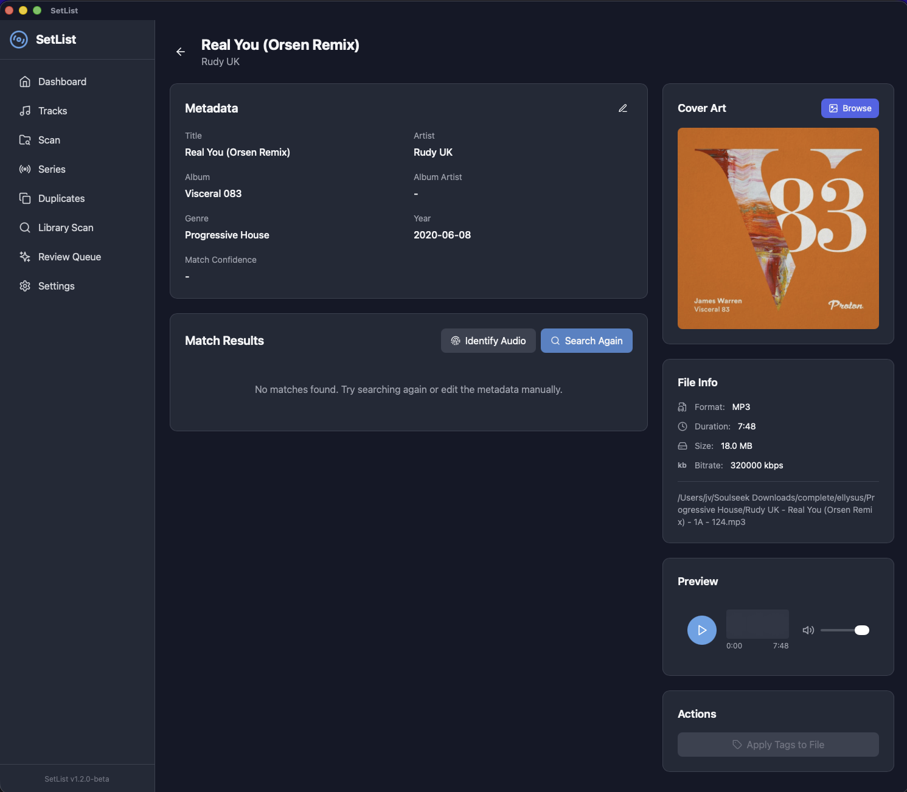
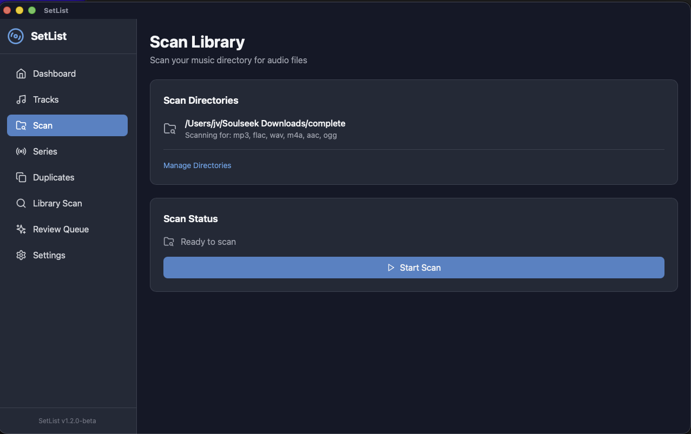
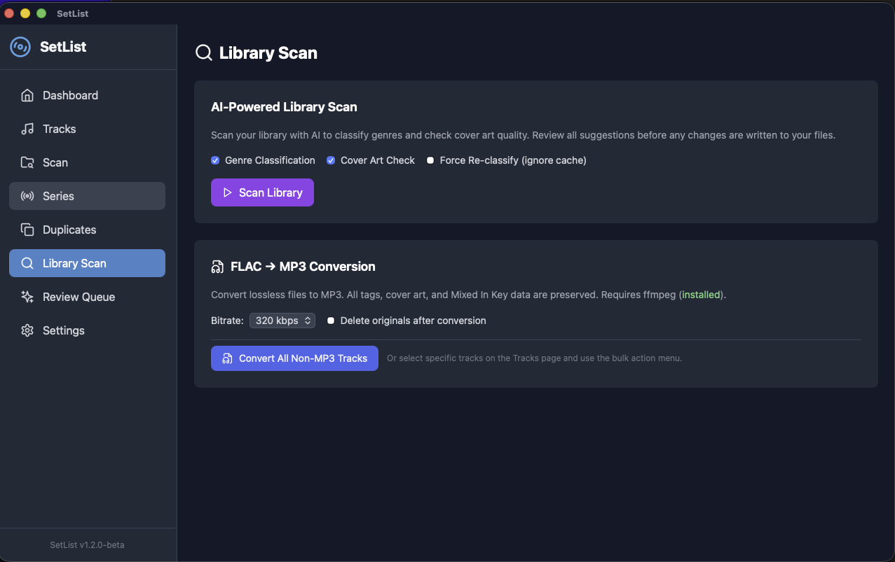
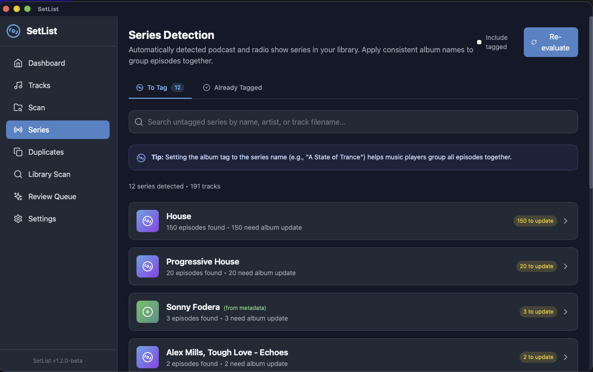
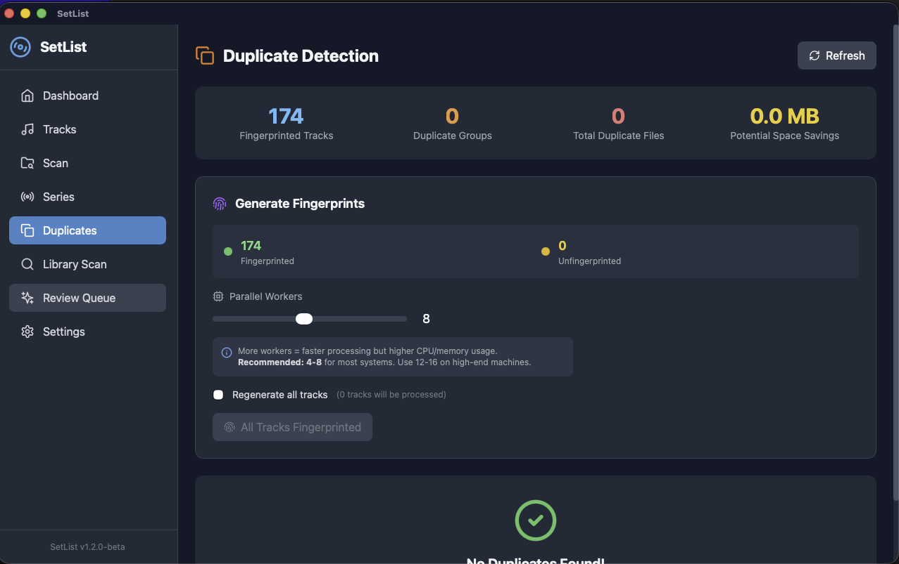
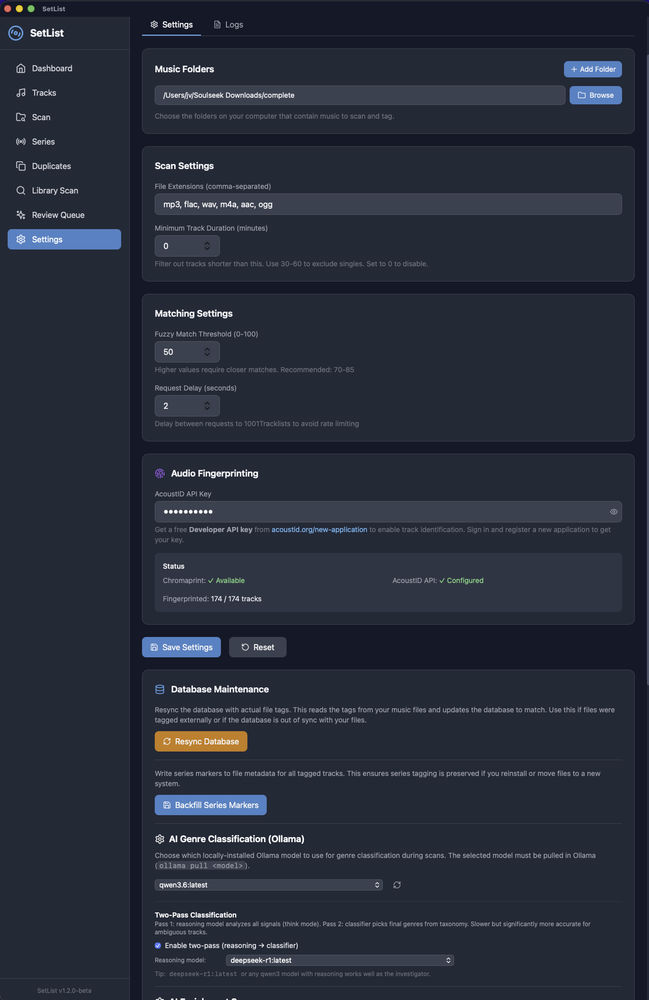
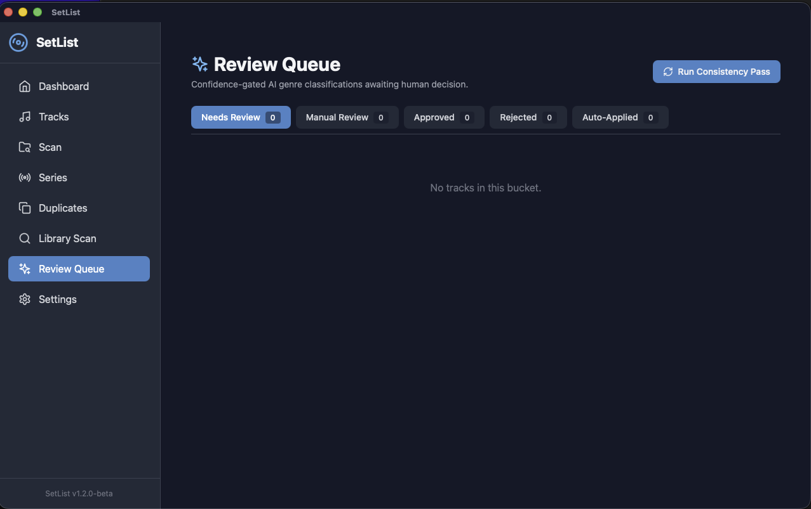

# SetList

**Version 1.3.0-beta** — A native macOS desktop application for organizing,
tagging, deduplicating, and AI-classifying a large music library. Built for DJs,
collectors, and anyone with thousands of files that need clean metadata.

SetList combines metadata from **1001Tracklists**, **MusicBrainz**, **Discogs**,
**Spotify**, **Last.fm**, **AcoustID**, and a **local Ollama LLM** to identify
tracks, suggest genres, fetch cover art, find duplicates, and write clean tags
back to your audio files — all locally, on your machine. No cloud account
required.

---

## Table of Contents

- [Features](#features)
- [Screenshots](#screenshots)
- [Installation](#installation)
- [First-Run Setup](#first-run-setup)
- [The Pages](#the-pages)
  - [Dashboard](#dashboard)
  - [Tracks](#tracks)
  - [Track Detail](#track-detail)
  - [Library Scan](#library-scan)
  - [Series](#series)
  - [Duplicates](#duplicates)
  - [Review Queue](#review-queue)
  - [Scan](#scan)
  - [Settings](#settings)
- [Workflows](#workflows)
- [AI Genre Classification](#ai-genre-classification)
- [Audio Fingerprinting (AcoustID)](#audio-fingerprinting-acoustid)
- [FLAC → MP3 Conversion](#flac--mp3-conversion)
- [Configuration & File Locations](#configuration--file-locations)
- [API Reference](#api-reference)
- [Architecture](#architecture)
- [Building from Source](#building-from-source)
- [Troubleshooting](#troubleshooting)
- [Privacy & Security](#privacy--security)
- [Credits](#credits)
- [License](#license)

---

## Features

### Library management
- 🎵 **Multi-format scanning** — MP3, FLAC, WAV, M4A, AAC, OGG, AIFF
- 📁 **Multiple music directories** with per-directory validation
- ⏱️ **Minimum-duration filter** to skip jingles, IDs, and short clips
- 🔄 **Resumable scans** — safe to stop and restart; AI results are persisted
  immediately after each batch
- 🧰 **Bulk operations** — apply tags, rename, fingerprint, convert, delete in
  batch

### Metadata & matching
- 🔍 **1001Tracklists matching** — fuzzy string search + scraping for DJ sets,
  radio shows, and podcast episodes
- 💿 **MusicBrainz** integration for CD albums (search by track listing)
- 🎶 **Discogs + Spotify + Last.fm** enrichment for genre, label, and release
  metadata cross-referencing
- 📝 **Tag writing** to file (ID3v2, Vorbis, MP4 atoms) — title, artist, album,
  genre, year, comments, custom Mixed-In-Key fields
- 🖼️ **Cover art** download, preview, embed, and lazy fallback to embedded art
- ✏️ **Manual override** — edit any field by hand at any time

### AI & classification
- 🤖 **Local Ollama models** for genre classification (zero data sent to the
  cloud)
- 🧠 **Two-pass classifier** — fast classifier + reasoning model (e.g.
  `deepseek-r1`) for low-confidence tracks
- 🚦 **Confidence-gated review queue** — auto-apply ≥85, needs-review 60–84,
  manual <60 (thresholds configurable)
- 🔁 **Consistency pass** to harmonize genre vocabulary across the whole library
- 📚 **Enrichment cache** in SQLite to avoid re-querying external APIs

### Audio fingerprinting & dedup
- 🆔 **AcoustID identification** via Chromaprint `fpcalc` (bundled)
- 🧬 **Parallel fingerprint generation** — configurable 1–16 workers
- 👯 **Duplicate detection** with waveform side-by-side comparison + safe delete
  modal
- 🤖 **Auto-resolve duplicates** by audio quality (bitrate, sample rate, file
  size, format)

### Conversion
- 🔄 **FLAC/WAV → MP3** bulk conversion via bundled-detected `ffmpeg`
- 🎚️ Bitrate selectable (128 / 192 / 256 / 320 kbps)
- 🗑️ Optional "Delete originals after conversion" (off by default; UI clearly
  marks the destructive action in red)
- 🔃 Background job with progress polling

### Series detection
- 📻 **Auto-grouping** of radio show / podcast episodes by filename pattern
- 🏷️ Apply album = series name across all episodes in one click
- 🧹 Remove tracks from a series, backfill markers, etc.

### UI / UX
- 🖥️ **Native Tauri** desktop bundle (`SetList.app`) — no browser tab, no
  background server
- 🌙 Dark-themed React UI built with Tailwind and React Query
- 🎧 **Built-in audio player** with waveform display
- 🔎 **Filter by genre, artist, album, format, status, review status**
- 🛟 **Error Boundary** UI catches frontend crashes gracefully

---

## Screenshots

| | |
|---|---|
|  |  |
| **Dashboard** — library stats at a glance | **Tracks** — filter, multi-select, bulk actions |
|  |  |
| **Track Detail** — match, edit, choose cover | **Scan** — point at music dirs |
|  |  |
| **Library Scan** — AI classification + FLAC→MP3 conversion | **Series Detection** — group radio shows |
|  |  |
| **Series Tagged** — manage applied series | **Duplicates** — waveform compare + safe delete |
|  |  |
| **Settings** — all knobs in one place | **Review Queue** — approve / reject AI suggestions |

---

## Installation

### Option A: Pre-built bundle (recommended)

1. Grab the latest `SetList_1.2.0_aarch64.dmg` from the GitHub Releases page.
2. Open the DMG and drag **SetList.app** to `/Applications` (or any folder).
3. Right-click → **Open** the first time (Gatekeeper) and confirm.
4. The first launch creates `~/.setlist/` for the database and bundled Python
   virtualenv.

### Option B: Build from source

See [Building from Source](#building-from-source) below.

### System requirements

- **macOS 13+** (Apple Silicon — `aarch64` bundle)
- ~500 MB disk for the app + virtualenv
- **Optional**: [Ollama](https://ollama.com) for AI classification
- **Optional**: `ffmpeg` for FLAC → MP3 conversion (`brew install ffmpeg`)
- **Optional**: `chromaprint` / `fpcalc` for AcoustID (bundled in the app, but
  installing it system-wide via `brew install chromaprint` is also fine)

---

## First-Run Setup

1. **Launch SetList.** The window opens to the Dashboard with zero tracks.
2. **Open Settings** (gear icon, lower-left).
   - **Music Directories** — click **Add Directory** and pick your music
     library root(s). Multiple directories supported.
   - (Optional) **Minimum Duration** — skip files shorter than N minutes.
   - (Optional) Paste an **AcoustID application key** from
     [acoustid.org/my-applications](https://acoustid.org/my-applications) —
     this is the *application* key, not the *user* submission key.
   - (Optional) **Discogs / Spotify / Last.fm** API keys for richer enrichment.
3. **Configure AI** (only if you want genre classification):
   - Install Ollama (`brew install ollama && ollama serve`).
   - Pull a model: `ollama pull qwen3:8b` (recommended) or any other tagger
     model.
   - In Settings → AI: set host (default `http://localhost:11434`) and pick
     the model from the dropdown.
4. **Go to the Scan page** and click **Start Scan** to import audio files.
5. **Go to the Library Scan page** and click **Start AI Scan** to run
   classification + cover quality checks. Suggestions land in the Review Queue.

---

## The Pages

### Dashboard
Quick library stats — total tracks, by format, by status, by genre. Recently
added section. Click anything to jump to the filtered Tracks view.

### Tracks
The main library browser.
- **Filters**: genre, artist, album, **file format** (mp3 / flac / wav / …),
  status, review status, has-match, has-cover, missing-fields.
- **Multi-select** with bulk actions:
  - **Apply Tags** — write metadata to file
  - **Generate Fingerprints** — queue selected for AcoustID
  - **Convert to MP3** — bulk FLAC/WAV → MP3
  - **Delete** (DB-only or DB + file, with confirmation)
- Per-row: status icon, cover thumbnail (matched URL → embedded art → music
  note), title, artist, album, format, duration, key/BPM.

### Track Detail
Everything about one track on a single screen.
- Top: file path, format, size, bitrate, sample rate, embedded MIK key/BPM.
- **Match candidates** from 1001Tracklists / MusicBrainz / Discogs with
  similarity scores — click to select.
- **Cover options** grid — pick the best image (or paste a URL).
- **Manual edit** form for title/artist/album/genre/year.
- **Apply Tags to File** button — writes everything to the audio file.
- **Identify Audio** button — uploads the fingerprint to AcoustID and lists
  candidate matches.

### Library Scan
The AI workflow page.
- **Start AI Scan** — runs genre classification + cover quality check across
  the whole library (or a track-id subset).
- Live progress: scanning → classifying → complete.
- **Suggestions** list with confidence badges; bulk Approve / Reject /
  Select-All.
- **FLAC → MP3 Conversion** panel — bitrate dropdown, "Delete originals after
  conversion" checkbox (red when checked), **Convert All Non-MP3 Tracks**
  button.

### Series
- **To Tag** tab — detected radio-show / podcast series that haven't been
  organized yet. One click to apply `album = series name` across every episode.
- **Tagged** tab — already-organized series, with options to remove tracks or
  backfill markers.

### Duplicates
- **Near-duplicate groups** based on AcoustID fingerprints + filename similarity.
- **Waveform side-by-side player** to A/B compare two files.
- **Safe Delete modal** showing both files' bitrate, duration, file size.
- **Auto-Resolve** — pick a quality rule (highest bitrate / largest file /
  prefer FLAC, etc.) and apply it across all groups.

### Review Queue
- AI suggestions that landed in `needs_review` (confidence 60–84) or
  `manual_review` (<60).
- For each: current tags, AI suggestion, reasoning, confidence.
- Buttons: **Approve** (writes to DB), **Reject**, **Edit & Approve**.

### Scan
- Configure directories (or just use Settings → Music Directories).
- **Start Scan** — walks your music dirs, extracts metadata, adds new rows to
  the DB (skips files already in the library).
- Live progress bar with file count, skipped, filtered (below min duration),
  and error log.

### Settings
- **Music directories** — add / remove / validate.
- **Scan filters** — file extensions, minimum duration.
- **API keys** — AcoustID, Discogs, Spotify, Last.fm.
- **AI** — Ollama host, classifier model, two-pass enable, reasoning model,
  consistency-pass settings, confidence thresholds.
- **Fingerprinting** — worker count (1–16).
- **Database** — view location, file size, **wipe database** (with double
  confirmation), browse logs.
- **Mounts** / volume info — useful when scanning external drives.

---

## Workflows

### "I just downloaded 200 new tracks"
1. **Scan** page → **Start Scan**. New rows added.
2. **Library Scan** page → **Start AI Scan**. AI tags suggested.
3. **Review Queue** → approve/edit the medium-confidence ones.
4. **Tracks** page → select all → **Apply Tags**.

### "I need to dedupe my collection"
1. **Tracks** → bulk-select → **Generate Fingerprints** (or just Generate-All
   from the Duplicates page).
2. **Duplicates** page → review groups visually.
3. **Auto-Resolve** with "prefer highest bitrate" — or hand-pick the keeper.

### "I want everything as MP3"
1. **Tracks** page → filter by **Format = FLAC**.
2. Select all → **Convert to MP3** (or use the **Convert All Non-MP3 Tracks**
   one-click on Library Scan).
3. Watch the progress poll. The DB row updates to point at the new `.mp3`.
4. Originals stay by default; check the red "Delete originals" box if you want
   them removed.

### "Help me clean up my radio-show downloads"
1. **Series** → **To Tag** tab.
2. Find your show (e.g. "John Digweed – Transitions"), preview detected
   episodes.
3. **Apply Album** — every episode now has `album = Transitions` and
   `track_number = episode number`.

### "Identify this mystery track"
1. **Tracks** → click the unknown file.
2. **Identify Audio** — uses Chromaprint to query AcoustID.
3. Pick the right candidate → **Apply** writes title/artist/album to the file.

---

## AI Genre Classification

SetList runs classification **entirely locally** via Ollama.

**Recommended models**:
- Fast classifier: `qwen3:8b`, `llama3.1:8b`, `gemma2:9b`
- Reasoning (low-confidence rerun): `deepseek-r1:latest`

**How it works**:
1. For each track, SetList builds a prompt from filename + existing tags +
   MusicBrainz/Discogs/Spotify enrichment data.
2. The classifier returns one or more genres + confidence (0–100) + reasoning.
3. If two-pass is enabled and confidence is below the gate, the reasoning model
   re-runs with chain-of-thought.
4. Results are written to `Track.ai_genre`, `ai_genre_confidence`,
   `ai_genre_source`, `ai_reasoning` immediately so a cancelled scan retains
   its work.
5. Routing:
   - **≥ auto-apply threshold** (default 85) → `matched_genre` set, status
     `auto_applied`.
   - **≥ needs-review threshold** (default 60) → `needs_review`.
   - **< 60** → `manual_review`.

**Consistency pass** (Settings → AI) sweeps the whole library and harmonizes
synonyms (e.g. "Prog House" → "Progressive House") using a vocabulary derived
from your current `matched_genre` distribution.

**Caching** — every external API call (Discogs, Spotify, Last.fm,
MusicBrainz) is cached in `enrichment_cache` so re-runs are fast and free.

---

## Audio Fingerprinting (AcoustID)

- Requires an AcoustID **application** key — free from
  [acoustid.org/my-applications](https://acoustid.org/my-applications).
- The fingerprinter is `fpcalc` (Chromaprint). The bundled app ships with a
  resolver that finds it via `FPCALC_BIN` env, `shutil.which`, or known
  Homebrew paths (`/opt/homebrew/bin`, `/usr/local/bin`).
- **Parallel generation** — Settings → Fingerprinting → Workers (1–16). Try
  4–8 on a laptop, 8–16 on a desktop.
- **Identify** mode is single-track and synchronous; **Generate** mode is
  asynchronous and shows a floating progress bar.
- Fingerprints are stored in `Track.fingerprint_hash` (short hash) and
  `Track.fingerprint_raw` (full Chromaprint blob).

---

## FLAC → MP3 Conversion

- Backend: `backend/services/converter.py` — uses `ffmpeg` directly.
- Bitrate: 128 / 192 / 256 / 320 kbps.
- Original tags + cover art + Mixed-In-Key key/BPM/energy are preserved.
- **"Delete originals after conversion"** is opt-in. The checkbox stays at
  "Delete originals after conversion" in both states; when checked the label
  turns red with a ⚠ glyph so the destructive intent is unmistakable. A
  browser-style confirm dialog also blocks accidental clicks.
- After a successful replace-conversion, the DB row is rewritten:
  `filepath`/`filename` point at the new `.mp3`, `file_format` = `mp3`,
  `file_size` updated, `fingerprint_hash`/`fingerprint_raw` cleared so the
  next AcoustID run regenerates against the new file.
- The job is fully async — progress polling at `/api/library/convert/status`.

If conversion says "ffmpeg not found", install via Homebrew:
```bash
brew install ffmpeg
```
The app will pick it up on next launch via `FFMPEG_BIN` resolution.

---

## Configuration & File Locations

| Path | Purpose |
|---|---|
| `~/.setlist/dj_tagger.db` | Main SQLite database (tracks, settings, suggestions, caches) |
| `~/.setlist/.venv-setlist/` | Bundled Python virtualenv created on first launch |
| `~/.setlist/app.log` | Backend log file (rotated) |
| `~/Music` | Default music directory (configurable) |
| `/Applications/SetList.app/Contents/Resources/resources/backend/` | Bundled Python backend code |
| `/Applications/SetList.app/Contents/Resources/resources/run.py` | Native launcher script |

### Environment Variables

| Variable | Default | Description |
|---|---|---|
| `MUSIC_DIR` | `~/Music` | Default music directory when none configured |
| `CONFIG_DIR` | `~/.setlist` | Database + settings + venv root |
| `PORT` | `5050` | Backend HTTP port (loopback-only) |
| `SETLIST_NATIVE` | unset | Set to `1` by the Tauri sidecar; switches paths to native mode |
| `FPCALC_BIN` | (auto-detected) | Override path to `fpcalc` |
| `FFMPEG_BIN` | (auto-detected) | Override path to `ffmpeg` |

Settings UI values are persisted to `dj_tagger.db` (the `settings` table) and
take precedence over env vars.

---

## API Reference

The backend exposes a REST API on `http://127.0.0.1:5050` (loopback only —
never bound to a public interface). Full OpenAPI docs are available at
`http://127.0.0.1:5050/docs` while the app is running.

### Top-level groups

| Prefix | Description |
|---|---|
| `/api/health` | Liveness probe (`{status, version, native}`) |
| `/api/tracks` | Tracks CRUD, filters, stats, stream, cover search, series |
| `/api/scan` | Filesystem scan (find new files) |
| `/api/library` | AI library scan, suggestions, MP3 conversion |
| `/api/match` | Run 1001Tracklists/MusicBrainz matching |
| `/api/tags` | Apply tags to files, batch apply, rename, preview |
| `/api/fingerprint` | AcoustID identify, generate, duplicates |
| `/api/ai` | Ollama models, classify, review queue, consistency pass, enrichment |
| `/api/covers` | Cover-art download + embedded image fetch |
| `/api/dedup` | Near-duplicate detection, auto-resolve, quality scoring |
| `/api/settings` | Get/patch settings, directories, mounts, logs, wipe DB |

Notable endpoints:

- `POST /api/library/convert/to-mp3` — body: `{track_ids: number[] | null, bitrate, replace_original}`. `null` = convert all non-MP3 tracks.
- `GET /api/tracks?file_format=mp3&genre=Progressive%20House&limit=200` — filtered tracks.
- `GET /api/tracks/filters` — returns `{genres, artists, albums, formats}` for dropdowns.
- `POST /api/library/scan` — start AI scan; body: `{track_ids, classify_genre, check_covers, force_reclassify}`.
- `GET /api/library/scan/status` — live phase + progress.
- `POST /api/library/scan/stop` — graceful cancel.
- `GET /api/covers/embedded/{id}/image` — embedded cover art for a track, with 1-hour cache.

---

## Architecture

```
SetList.app                                   ← Tauri (Rust) shell
├── Contents/MacOS/setlist                    ← Native binary; spawns:
└── Contents/Resources/resources/
    ├── run.py                                ← Native launcher
    └── backend/                              ← FastAPI + Uvicorn
        ├── main.py                           ← App factory, CORS, lifespan
        ├── api/                              ← Routers (tracks, library, ai, ...)
        ├── services/                         ← Business logic
        │   ├── scanner.py                    ← Filesystem walker + tag reader
        │   ├── library_scan.py               ← AI scan orchestrator
        │   ├── matcher.py                    ← 1001TL/MB/Discogs matcher
        │   ├── ai_genre.py                   ← Ollama classifier wrapper
        │   ├── enrichment.py                 ← External-API metadata cache
        │   ├── fingerprint.py                ← Chromaprint + AcoustID
        │   ├── converter.py                  ← ffmpeg-based FLAC→MP3
        │   ├── dedup.py                      ← Near-duplicate detection
        │   ├── cover_art.py                  ← Embedded art extraction
        │   ├── mik.py                        ← Mixed-In-Key tag reader
        │   └── tagger.py                     ← Mutagen-based tag writer
        ├── models/                           ← SQLAlchemy ORM + Pydantic
        └── services/database.py              ← Async SQLAlchemy + aiosqlite

frontend/                                     ← React + Vite (built into dist/)
├── src/
│   ├── pages/                                ← Dashboard, Tracks, Series, ...
│   ├── components/                           ← TrackCover, AudioPlayer, ...
│   ├── contexts/                             ← Audio context, theme
│   └── api.js                                ← Axios + React Query helpers
└── src-tauri/                                ← Rust shell (sidecar, CSP, menus)
```

### Tech stack
- **Backend**: Python 3.13, FastAPI, Uvicorn, SQLAlchemy 2 async, aiosqlite,
  Mutagen, Chromaprint, RapidFuzz, httpx, Playwright (1001TL scraping),
  Ollama client.
- **Frontend**: React 18, Vite, Tailwind CSS, React Query, Lucide icons,
  WaveSurfer.js.
- **Shell**: Tauri 2, Rust 1.77+.

---

## Building from Source

### Prerequisites

```bash
# Required
brew install python@3.13 node rust
xcode-select --install              # Apple's command-line tools

# Recommended (used by the app at runtime)
brew install chromaprint            # provides `fpcalc`
brew install ffmpeg                 # FLAC → MP3 conversion
brew install ollama                 # AI genre classification
```

### Clone and build

```bash
git clone https://github.com/jvenuto80/set-list.git
cd set-list

# Single command — builds frontend, bundles backend, builds Tauri app,
# copies SetList.app and DMG to ~/Desktop
bash scripts/build-macos.sh
```

Outputs:
- `~/Desktop/SetList.app` — the runnable bundle (also installed to your Desktop)
- `~/Desktop/SetList_1.2.0_aarch64.dmg` — installable disk image

### Run in dev mode

```bash
bash scripts/dev-macos.sh
```

- Backend runs on `127.0.0.1:5050` with auto-reload.
- Frontend runs on `5173` with HMR.
- The Tauri window opens against the dev server.

### Run the headless backend only

Useful for testing the API directly:

```bash
python3 run.py
# → http://127.0.0.1:8080
```

This bootstraps `~/.setlist/.venv-setlist`, installs `frontend/`
dependencies, builds the React bundle, and starts Uvicorn — no Tauri shell.

---

## Troubleshooting

### "Network error" on every page / Tracks list empty
The Python sidecar didn't start. Check the log:
```bash
tail -60 ~/.setlist/app.log
# and / or the Tauri stderr:
"/Applications/SetList.app/Contents/MacOS/setlist"  # run from terminal
```
A common cause is a missing dependency in `~/.setlist/.venv-setlist`. Delete
the venv and relaunch to rebuild it from scratch:
```bash
rm -rf ~/.setlist/.venv-setlist
open ~/Desktop/SetList.app
```

### "Identify Audio" says "invalid API key"
Use the **application** key from
[acoustid.org/my-applications](https://acoustid.org/my-applications), **not**
the user submission key. They're different fields on that page.

### "ffmpeg not found" even though `brew install ffmpeg` succeeded
GUI apps launched from Finder have a stripped `PATH` — Homebrew's
`/opt/homebrew/bin` isn't visible. SetList's resolver checks the standard
locations automatically, but you can force it with:
```bash
launchctl setenv FFMPEG_BIN /opt/homebrew/bin/ffmpeg
```
Then relaunch the app. (Same trick works for `FPCALC_BIN`.)

### Audio playback fails
- The file may have moved or been renamed outside of SetList. Run a fresh
  Scan to repair stale rows.
- Check `~/.setlist/app.log` for `Error streaming ...` entries.

### Scan finds zero files
- Verify the directory path in Settings exists and is readable.
- Verify the extension list includes your file type (Settings → Scan).
- If on an external drive, make sure the volume is mounted before launching.

### A long-running scan or conversion got "stuck running"
Fixed in 1.2.0-beta. If you still see it on an older version, restarting the
app clears the in-memory flag.

### AI scan says "Ollama not reachable"
- `ollama serve` must be running (verify: `curl localhost:11434`).
- Confirm the model is installed: `ollama list`.

---

## Privacy & Security

- **100% local processing.** The backend binds to `127.0.0.1` only; CORS is
  restricted to the Tauri webview origin. Nothing is exposed to the network.
- **No telemetry.** SetList does not phone home.
- **External API calls** are made only for the features that need them:
  AcoustID (fingerprint identify), MusicBrainz, Discogs, Spotify, Last.fm,
  1001Tracklists scraping. You can leave the API keys blank to disable any of
  these.
- **AI classification** runs in your local Ollama instance — no cloud LLM
  involved.
- **File operations** (rename, tag-write, delete, conversion) operate only on
  paths inside directories you've explicitly added in Settings.

---

## Credits

- [1001-tracklists-api](https://github.com/jvenuto80/1001-tracklists-api) — basis for the 1001TL scraper
- [Mutagen](https://mutagen.readthedocs.io/) — audio metadata I/O
- [Chromaprint / AcoustID](https://acoustid.org/) — audio fingerprinting
- [RapidFuzz](https://github.com/maxbachmann/RapidFuzz) — fast fuzzy matching
- [FastAPI](https://fastapi.tiangolo.com/) — Python web framework
- [SQLAlchemy](https://www.sqlalchemy.org/) — ORM
- [React](https://react.dev/), [Tauri](https://tauri.app/), [Tailwind CSS](https://tailwindcss.com/), [React Query](https://tanstack.com/query)
- [WaveSurfer.js](https://wavesurfer-js.org/) — waveform rendering
- [Ollama](https://ollama.com/) — local LLM inference
- [ffmpeg](https://ffmpeg.org/) — audio conversion
- [MusicBrainz](https://musicbrainz.org/) / [Discogs](https://discogs.com/) / [Spotify](https://developer.spotify.com/) / [Last.fm](https://www.last.fm/api) — metadata APIs

---

## License

MIT — see [LICENSE](LICENSE).

## Contributing

PRs and issues welcome at <https://github.com/jvenuto80/set-list>. Run
`bash scripts/dev-macos.sh` to spin up a hot-reloading dev environment.

See [CHANGELOG.md](CHANGELOG.md) for release notes and [ROADMAP.md](ROADMAP.md)
for planned features.
